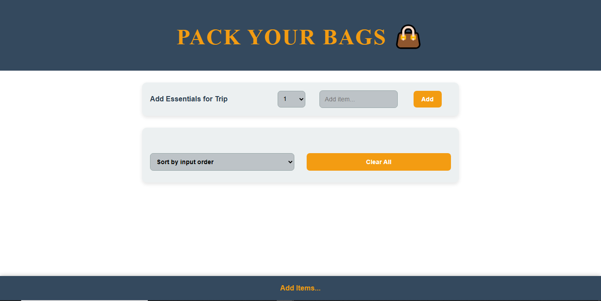
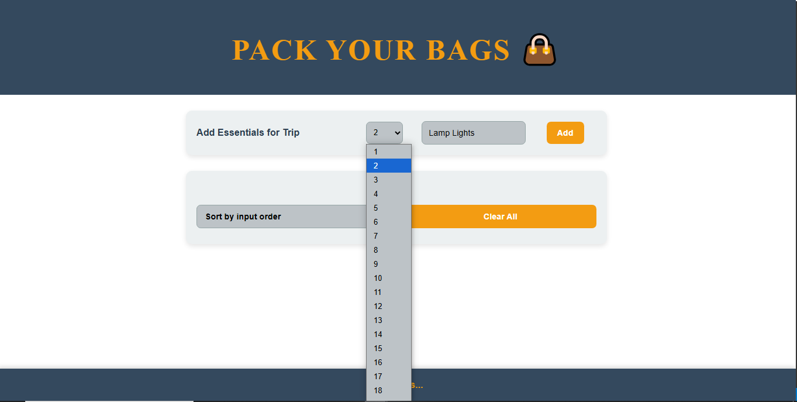
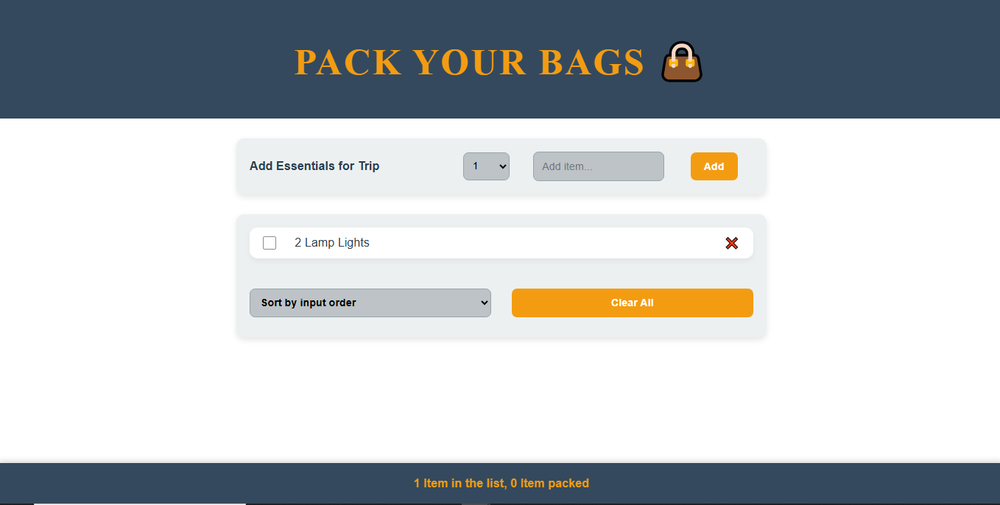
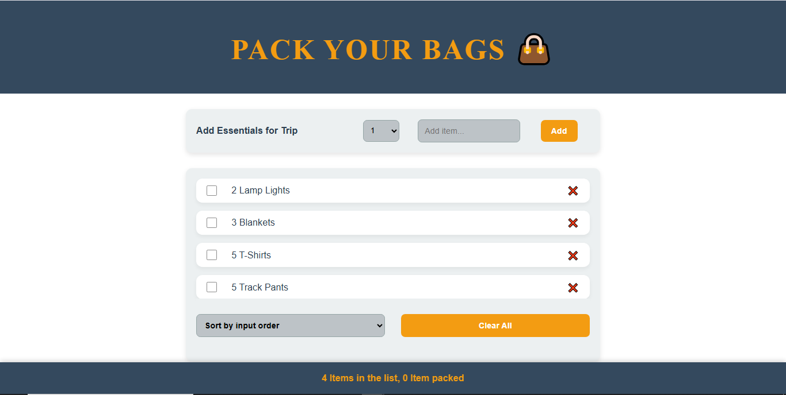
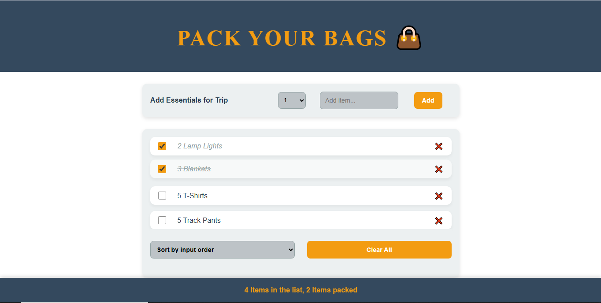
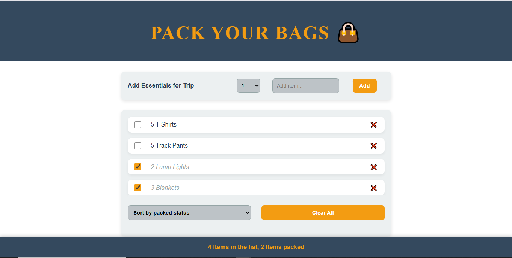
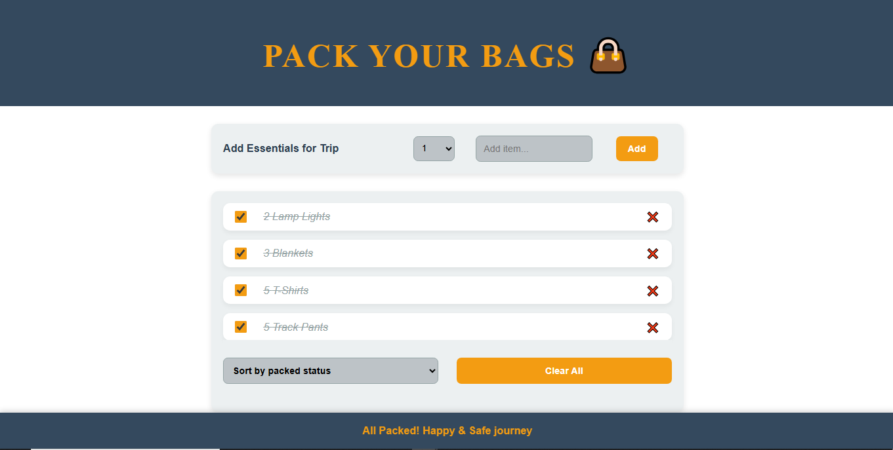

# 👜 Pack Your Bags

Pack Your Bags is a lightweight and interactive React app that helps you plan and organize your travel packing list. Add items, track what's packed, and sort or clear your list easily. It’s a fun and practical tool designed to simplify your pre-travel routine — so you never forget your essentials again!


## ✨ Features

- Add items with quantity to your packing list
- Mark items as packed/unpacked
- Sort items by input order or packed status
- Clear the entire list with a confirmation prompt
- Responsive UI with a clean, minimal design


## 🚀 Getting Started

### 1. Clone the Repository

```bash
git clone https://github.com/shivasayz/packyourbags.git
```

```bash
cd packyourbags
```

### 2. Install Dependencies

```bash
npm install
```

### 3. Run the App

```bash
npm start
```
Your app will open at https://localhost:3000


## 🛠️ Technologies Used

- React
- JavaScript (ES6+)
- HTML & CSS

## 📸 Preview
### 1. Home Page


### 2. Add Items


### 3. list After Items Added


### 4. Few More Items


### 5. Marked as Packed


### 6. Sort By Packed Status


### 7. All Packed


